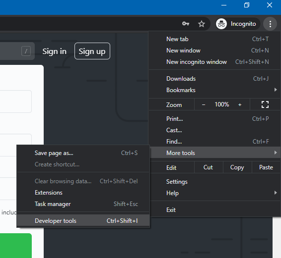
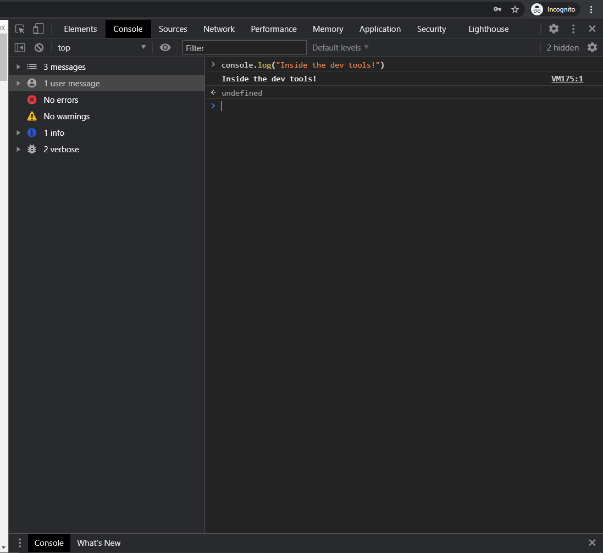
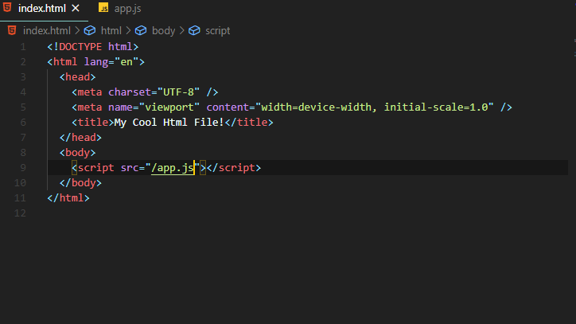
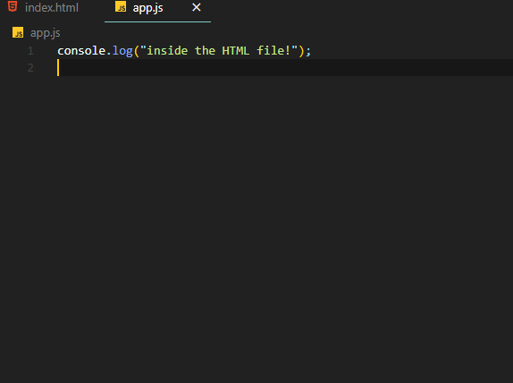
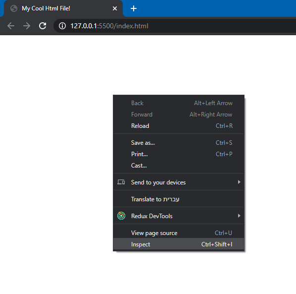
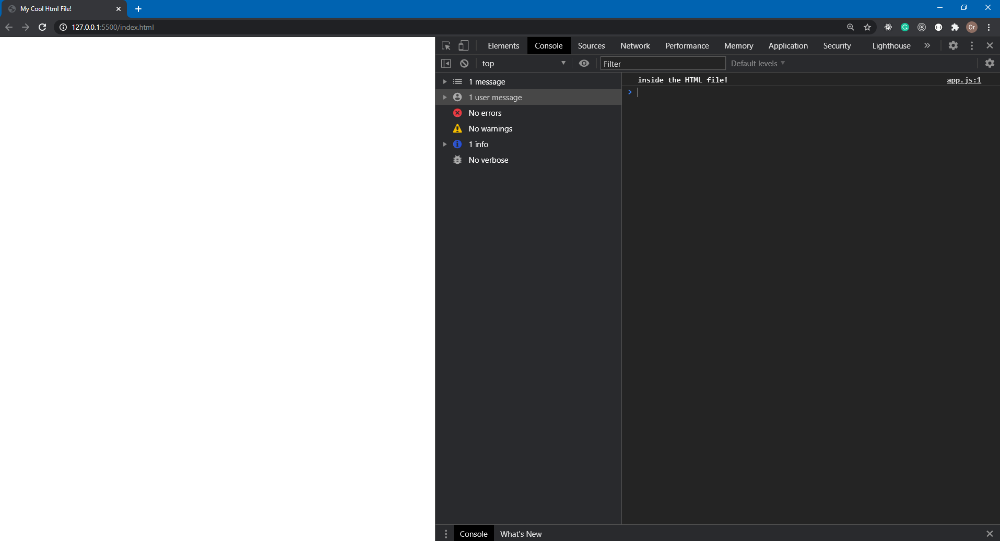
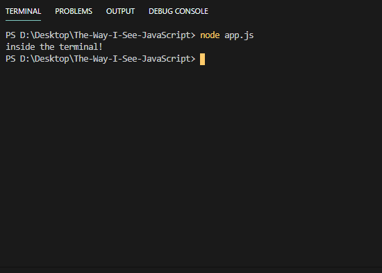

# How To Use JavaScript?

### So we want to write some JS code, and we want to learn how to use it, now the question is - How?.

### Well, Javascript, as I mentioned, can run both on the client-side (using a browser engine for example), and on the server-side using NodeJS.

### Let me show you how...

 
 

## Client-side (front-end development):

### Here we have two options

- Use the development tools inside the browser and write our code there:

  - 
  - 

- Use an HTML file and include a script tag pointing to a .js file:
  - 
  - 
  - 
  - 

Normally, we will use the second option, as it's better for long term development.
The first option can be used for learning purposes, but not for developing a real app and handling data.

## Server-side (back-end development):

- We can run JS code on our computer without using a client (no browser), by instaling NodeJS and running the .js file in the terminal:
  - 
  - 

### Now that we know where we can write our JS code, let's begin to learn some of it.
